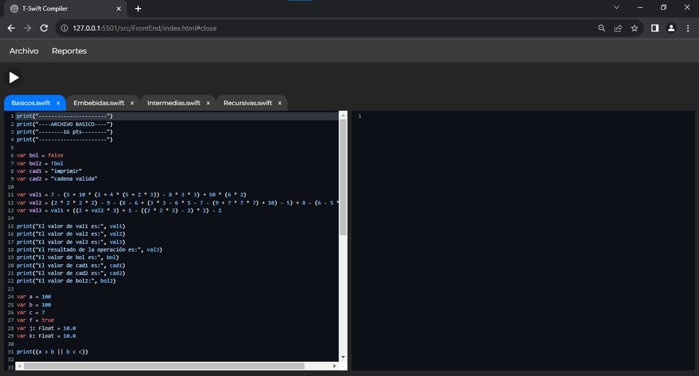
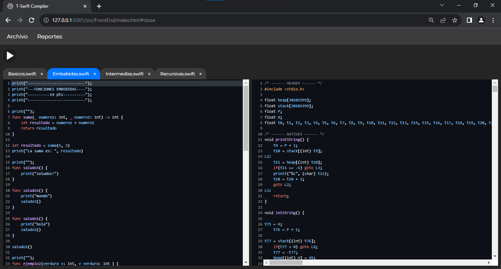
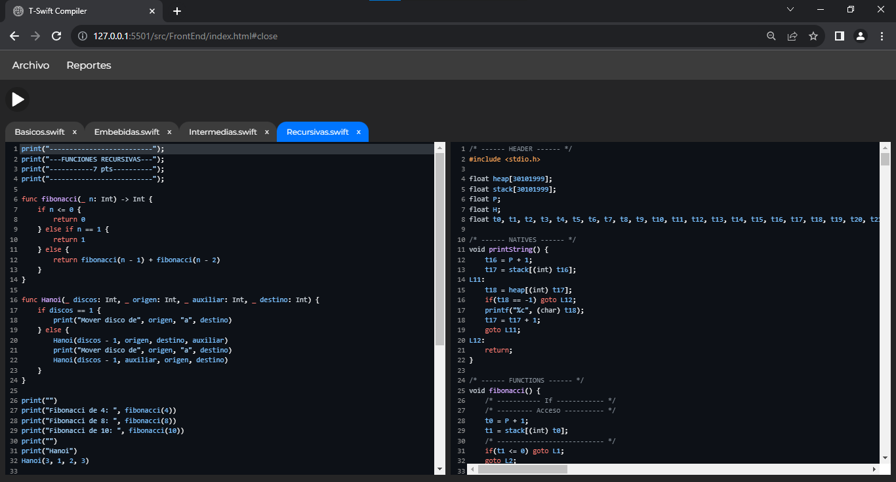
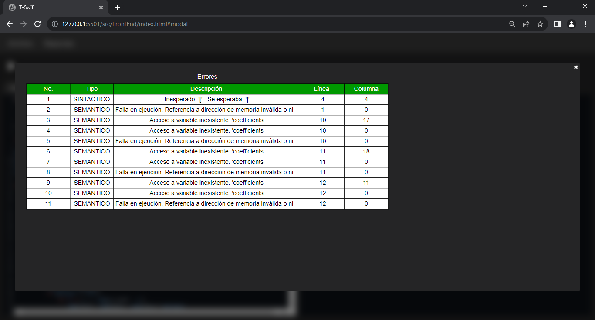
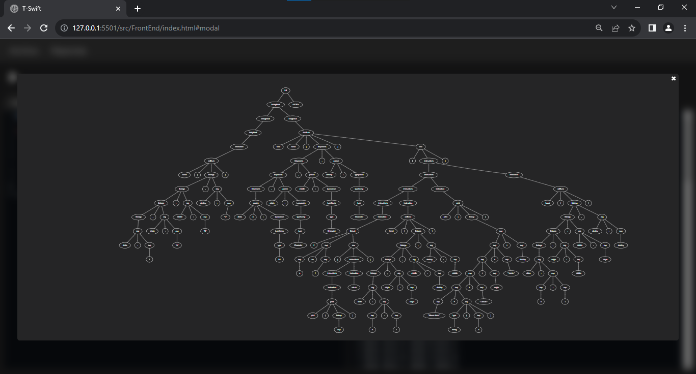
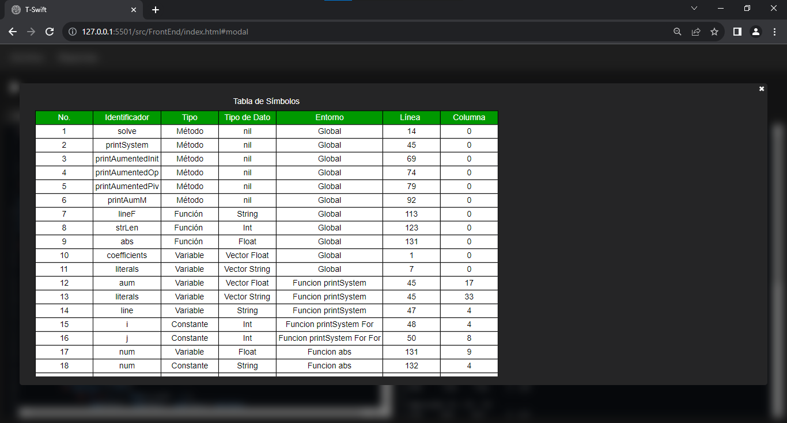
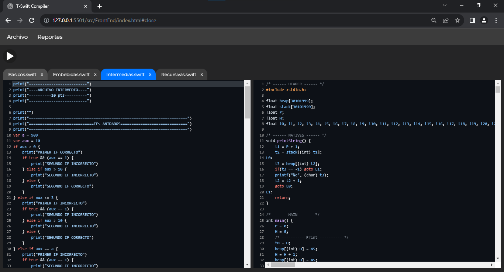
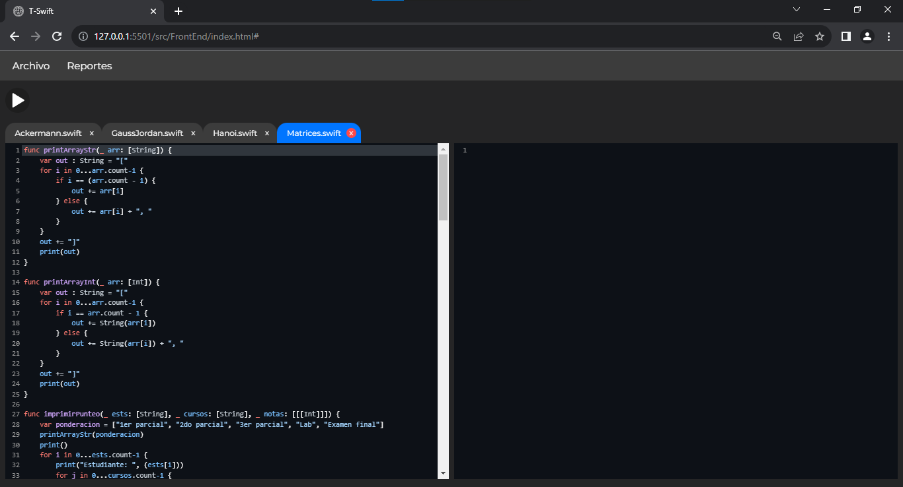

# Proyecto 2 OLC2 2S 2023

## 201908355 - Danny Hugo Bryan Tejaxún Pichiyá

## T-Swift Compiler

## Manual de Usuario

## Índice

1. [Ejecutar Código](#1-ejecutar-código)
2. [Consola](#2-consola)
3. [Reporte De Errores](#3-reporte-de-errores)
4. [CST](#4-cst)
5. [Tabla De Símbolos](#5-tabla-de-símbolos)
6. [Sintaxis](#6-sintaxis)
7. [Sistema de Pestañas](#7-sistema-de-pestañas)

## 1. Ejecutar Código
* ### Para Ejecutar el código se debe hacer click en el botón de Play.



* ### Es posible tener más de un archivo abierto simultáneamente. [Ver Sistema de Pestañas](#7-sistema-de-pestañas).



[Subir](#manual-de-usuario)

## 2. Consola
* ### En la consola es posible visualizar todo lo que reciba el argumento de la función nativa print.



[Subir](#manual-de-usuario)

## 3. Reporte De Errores
* ### En caso de haber errores Sintácticos o Semánticos se puede generar un reporte y puede visualizarse seleccionando la opción correspondiente del menú Reportes.



[Subir](#manual-de-usuario)

## 4. CST
* ### Al haber código en el editor se puede generar un reporte del CST y puede visualizarse seleccionando la opción correspondiente del menú Reportes.



[Subir](#manual-de-usuario)

## 5. Tabla De Símbolos
* ### Al ejecutar el código escrito en el editor se puede visualizar un reporte de la Tabla de Símbolos seleccionando la opción correspondiente del menú Reportes.



[Subir](#manual-de-usuario)

## 6. Sintaxis

* Declaración de Variables
```swift
var id: type = value
var id: [[type]] = value
var id: [type] = value
var id: type?
var id = value
```
* Declaración de Métodos y Funciones
```swift
func id((externName|_)? param1 : type,(externName|_)? param2: type, ... (externName|_)? paramN: type) -> type {
    //instrucciones
    return expression
}
func id((externName|_)? param1 : type,(externName|_)? param2: type, ... (externName|_)? paramN: type) {
    //instrucciones
}
func id() -> type {
    //instrucciones
    return expression
}
func id() {
    //instrucciones
}
```
* Ciclos
```swift
for id in limInf ... limSup {
    //instrucciones
}
for id in id {
    //instrucciones
}
while condición {
    //instrucciones
}
```
* Estructuras de Control
```swift
//if else if                //if else                   //if
if condicion {             if condicion {             if condicion {
    //instrucciones             //instrucciones             //instrucciones
}                          }                          }
else if condicion {        else {
    //instrucciones             //instrucciones
}                          }
...
else {
    //instrucciones
}

//switch
switch expresion {
    case expresion:
        //instrucciones
    case expresion:
    case expresion:
    ...
    case expresion:
        //instrucciones
    default:
        //instrucciones
}
```
* Casteo
```java
var id: type = type(expresion)
var id = type(expresion)
```

[Subir](#manual-de-usuario)

## 7. Sistema de Pestañas
* ### Mediante el Sistema de Pestañas es posible trasladarse entre proyectos del Lenguaje TypeWise.



* ### Es posible eliminar pestañas cuando ya no se requiera editar el código de algún proyecto.



[Subir](#manual-de-usuario)

## TypeWise

## Manual Técnico

## Índice

1. [Análisis Léxico Y Sintáctico](#1-análisis-léxico-y-sintáctico)
2. [Tipos De Datos](#2-tipos-de-datos)
    1. [Tipo Dominante En Operaciones Aritméticas](#2.1-tipo-dominante-en-operaciones-aritméticas)
    2. [Tipos De Retorno](#2.2-tipos-de-retorno)
3. [Clases Abstractas](#3-clases-abstractas)
4. [Entornos](#4-entornos)
4. [Generador C3D](#5-generador-c3d)

## 1. Análisis Léxico Y Sintáctico
* [Ver Expresiones Regulares y Gramática](./Gramatica.md)

## 2. Tipos De Datos
```go
type Type int

const (
	INT Type = iota
	FLOAT
	STRING
	BOOLEAN
	CHAR
	NIL
	VECTOR
	MATRIX
)

```
[Subir](#manual-técnico)


## 2.1. Tipo Dominante En Operaciones Aritméticas
### 2.1.1. Suma
|    +    |  INT   | DOUBLE | STRING |
|    -    |   -    |   -    |   -    |
| INT     | INT    | DOUBLE | NIL    |
| DOUBLE  | DOUBLE | DOUBLE | NIL    |
| STRING  | NIL    | NIL    | STRING |

[Subir](#manual-técnico)

### 2.1.2. Resta
|    -    | INT    | DOUBLE |
|    -    |   -    |   -    |
| INT     | INT    | DOUBLE |
| DOUBLE  | DOUBLE | DOUBLE |

[Subir](#manual-técnico)

### 2.1.3. Multiplicación
|    *    | INT    | DOUBLE |
|    -    |   -    |   -    |
| INT     | INT    | DOUBLE |
| DOUBLE  | DOUBLE | DOUBLE |

[Subir](#manual-técnico)

### 2.1.4. División
|    /    | INT    | DOUBLE |
|    -    |   -    |   -    |
| INT     | INT    | DOUBLE |
| DOUBLE  | DOUBLE | DOUBLE |

[Subir](#manual-técnico)

### 2.1.6. Módulo
|    %    | INT    |
|    -    |   -    |
| INT     | INT    |

[Subir](#manual-técnico)

## 2.2. Tipos De Retorno
Es el tipo que retorna cada Expresión para tener referencia, no solo del valor sino también del tipo de dato resultante.
```go
type ReturnValue struct {
	StrValue   string
	NumValue   interface{}
	IsTmp      bool
	Type       Type
	TrueLabel  []string
	FalseLabel []string
	OutLabel   []string
}
```
[Subir](#manual-técnico)

## 3. Interfaces

## 3.1. Expresión
* Se implementó la clase Expression que es la clase padre de todas aquellas funcionalidades del lenguaje TypeWise que retornan un valor, tales como:
 
    * Llamada a Función
    * Acceso a Variables
        - Primitivas
        - Posiciones de Vectores
        - Posiciones de Matrices
    * Sentencia 'Return'
    * Operaciones
        - Aritméticas
        - Relacionales
        - Lógicas
    * Funciones Embebidas
        - String
        - Int
        - Float
    * Casteo

Es necesario que cada expresión tenga una referencia de los entornos globales relativamente, ya que desde un bloque de código interno se puede acceder a las variables y funciones de los entornos más globales.

```go
type Expression interface {
	LineN() int
	ColumnN() int
	Exec(env *env.Env, c3dgen *C3DGen.C3DGen) *utils.ReturnValue
}
```
[Subir](#manual-técnico)

## 3.2. Instrucción
* Se implementó la clase Instruction que es la clase padre de todas aquellas funcionalidades del lenguaje TypeWise que no retornan un valor, tales como:
    * Función Append propia de los Vectores
    * Inicialización de Variables
        - Primitivas
        - Vectores
        - Matrices
    * Sentencias de Transferencia
        - Continue
        - Break
    * Reasignación de Valores
        - Variables Primitivas
        - Posiciones de Vectores
        - Posiciones de Matrices
    * Declaración de Funciones
    * Estructuras de Control
        - If
        - Else If
        - Else
        - Guard
        - Switch Case
        - Ciclos
            * For
            * While
    * Bloques de Instrucciones

Es necesario que cada instrucción tenga una referencia de los entornos globales relativamente, ya que desde un bloque de código interno se puede acceder a las variables y funciones de los entornos más globales.

```go
type Instruction interface {
	LineN() int
	ColumnN() int
	Exec(env *env.Env, c3dgen *C3DGen.C3DGen) *utils.ReturnValue
}
```
[Subir](#manual-técnico)

## 4. Entornos
En el entorno se guarda la referencia hacia cada variable, arreglo, método o función declarada.
* Para declarar una variable nueva primero se debe verificar que no exista previamente, en el Map de identificadores del entorno, una variable con el mismo nombre sin importar el tipo.
```go
func (env *Env) SaveID(isVariable bool, id string, value *utils.ReturnValue, Type utils.Type, line, column int) *Symbol {
	if _, exists := (*env.Ids)[id]; !exists {
		(*env.Ids)[id] = &Symbol{IsVariable: isVariable, IsPrimitive: true, Id: id, Type: Type, Position: env.Size, IsGlobal: env.Name == "Global"}
		SymTable.Push(NewSymTab(line, column+1, isVariable, true, id, env.Name, Type, utils.NIL))
		env.Size += 1
		return (*env.Ids)[id]
	}
	env.SetError("Redeclaración de variable existente", line, column)
	return nil
}
```
[Subir](#manual-técnico)

* Para obtener el valor de una variable es necesario hacer una búsqueda en el Map de identificadores de cada entorno comenzando por el entorno local. En caso de no encontrar el identificador en el entorno local es necesario ascender de entornos hasta encontrar el identificador de la variable, si es que se declaró previamente.
```go
func (env *Env) GetValueID(id string, line, column int) *Symbol {
	var current *Env = env
	for current != nil {
		if symbol, exists := (*current.Ids)[id]; exists {
			return symbol
		}
		current = current.previous
	}
	current.SetError(fmt.Sprintf("Acceso a variable inexistente. '%s'", id), line, column)
	return nil
}
```
[Subir](#manual-técnico)

* Para declarar una función o método nueva primero se debe hacer una búsqueda en el Map de funciones del entorno global. En caso de no encontrar el identificador de la función en el entorno global se guarda la nueva función.
```go
func (env *Env) SaveFunction(id string, Func *interface{}, Type utils.Type, line, column int) bool {
	if _, exists := (*env.Functions)[id]; !exists {
		(*env.Functions)[id] = Func
		SymTable.Push(NewSymTab(line, column+1, false, false, id, env.Name, Type, utils.NIL))
		return true
	}
	env.SetError("Redefinición de función existente", line, column)
	return false
}
```
[Subir](#manual-técnico)

* Para obtener una función o método, para posteriormente ejecutarla, primero se debe hacer una búsqueda en el Map de funciones del entorno global. En caso de no encontrar el identificador de la función en el entorno global no se retorna nada.
```go
func (env *Env) GetFunction(id string, line, column int) *interface{} {
	if _, exists := (*env.Functions)[id]; exists {
		return (*env.Functions)[id]
	}
	env.SetError("Acceso a función inexistente", line, column)
	return nil
}
```
[Subir](#manual-técnico)

* Para obtener el entorno global es necesario ir ascendiendo desde el entorno local actual hasta que ya no exista un entorno global relativo del entorno actual.
```go
func (env *Env) GetGlobal() *Env {
	current := env
	for current.previous != nil {
		current = current.previous
	}
	return current
}
```
[Subir](#manual-técnico)

## 5. Generador C3D
```go
type C3DGen struct {
	TemporalCount   int
	LabelCount      int
	C3DInstructions []string
	C3DCode         []string
	C3DNatives      []string
	C3DFunctions    []string
	Temporals       []string
	PrintString     bool
	ConcatString    bool
	IntString       bool
	MainC3DCode     bool
	BreakLabel      string
	ContinueLabel   string
}
```

* El generador ubica las operaciones en arreglos.
```go
func (g *C3DGen) GenerateFinalCode() {
	// HEADER
	g.C3DCode = append(g.C3DCode, "/* ------ HEADER ------ */")
	g.C3DCode = append(g.C3DCode, "#include <stdio.h>")
	g.C3DCode = append(g.C3DCode, "")
	g.C3DCode = append(g.C3DCode, "float heap[30101999];")
	g.C3DCode = append(g.C3DCode, "float stack[30101999];")
	g.C3DCode = append(g.C3DCode, "float P;")
	g.C3DCode = append(g.C3DCode, "float H;")
	// TEMPORALS
	tempArr := g.GetTemps()
	if len(tempArr) > 0 {
		tmpDec := fmt.Sprintf("float %v", tempArr[0])
		for _, s := range tempArr[1:] {
			tmpDec += ", "
			tmpDec += fmt.Sprintf("%v", s)
		}
		tmpDec += ";"
		g.C3DCode = append(g.C3DCode, tmpDec)
	}
	g.C3DCode = append(g.C3DCode, "")
	// NATIVES
	if len(g.C3DNatives) > 0 {
		g.C3DCode = append(g.C3DCode, "/* ------ NATIVES ------ */")
		for _, s := range g.C3DNatives {
			g.C3DCode = append(g.C3DCode, s)
		}
	}
	// FUNCTIONS
	if len(g.C3DFunctions) > 0 {
		g.C3DCode = append(g.C3DCode, "/* ------ FUNCTIONS ------ */")
		for _, s := range g.C3DFunctions {
			g.C3DCode = append(g.C3DCode, s)
		}
	}
	// MAIN
	g.C3DCode = append(g.C3DCode, "/* ------ MAIN ------ */")
	g.C3DCode = append(g.C3DCode, "int main() {")
	g.C3DCode = append(g.C3DCode, "\tP = 0;")
	g.C3DCode = append(g.C3DCode, "\tH = 0;")
	for _, s := range g.C3DInstructions {
		g.C3DCode = append(g.C3DCode, s)
	}
	g.C3DCode = append(g.C3DCode, "\treturn 0;\n}")
}
```

[Subir](#manual-técnico)